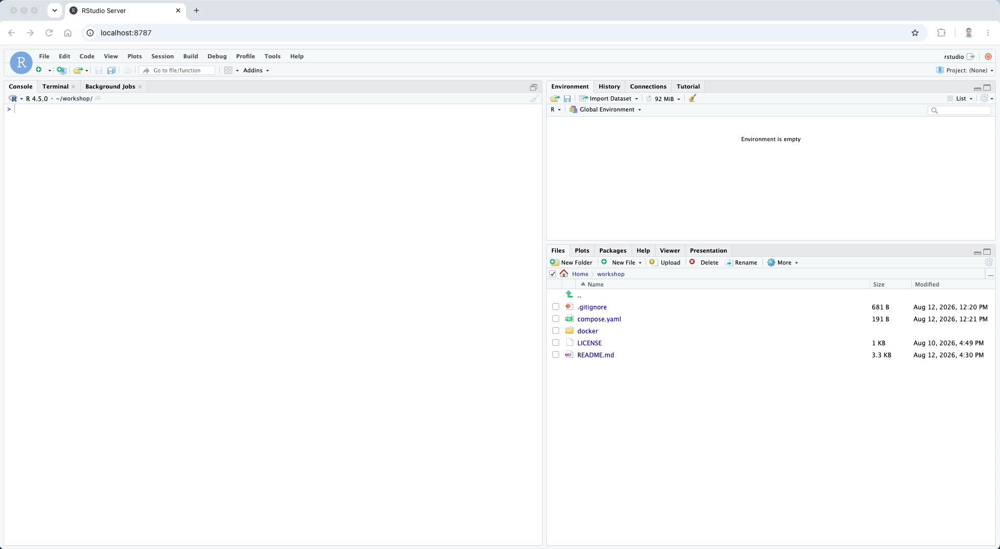

# grk2727-ws260824

This repository contains the materials for the GRK2727 workshop on 24 August 2026, including the workshop code, data, and computational environment.

The workshop will be carried out in R using RStudio. You do not need to install R, RStudio, or any R packages yourself. We have prepared the complete software environment in a Docker image.

For the workshop setup, you only need:

* Git — to download the workshop repository
* Docker — to run the prepared computational environment

## Quick start

If you already have Git and Docker installed, make sure Docker is running and execute:

```
git clone https://github.com/amelzulji/grk2727-ws260824.git
cd grk2727-ws260824
docker compose up -d
```

Then open your web browser and go to:

```
http://localhost:8787
```



> [!TIP]
> If RStudio opens as shown above, your setup is complete and you are ready for the workshop.

If you still need to install Git or Docker, follow the setup steps below.

## 1. Open a terminal

Windows: open PowerShell or Windows Terminal.
macOS/Linux: open Terminal.

## 2. Check Git

Run:

```
git --version
```

If a version is printed, continue to the next step.

If Git is not installed:

### Windows

```
winget install --id Git.Git -e --source winget
```

### macOS

```
xcode-select --install
```

This installs Apple’s Command Line Tools, which include Git. It does not install the full Xcode application.

### Linux (Ubuntu/Debian)

```
sudo apt update
sudo apt install git
```

After installation, reopen the terminal and check again:

```
git --version
```

## 3. Check Docker

Run:

```
docker --version
docker compose version
```

If versions are printed, continue to the next step.

If Docker is not installed:

* Windows/macOS: install [Docker Desktop](https://www.docker.com/products/docker-desktop/)
* Linux: install Docker Engine and the Docker Compose plugin for your Linux distribution

After installation, start Docker and check again:

```
docker --version
docker compose version
```

On Windows and macOS, keep Docker Desktop running while using the workshop environment.

## 4. Download the workshop repository

Run:

```
git clone https://github.com/amelzulji/grk2727-ws260824.git
cd grk2727-ws260824
```

You only need to clone the repository once.

## 5. Start the workshop environment

Make sure Docker is running, then run:

```
docker compose up -d
```

The first time you run this command, Docker will download the prepared workshop image.

## 6. Open RStudio

Open your web browser and go to:

```
http://localhost:8787
```

If everything is set up correctly, RStudio should look similar to the image bellow:


You can now stop the environment:

```
docker compose down
```
